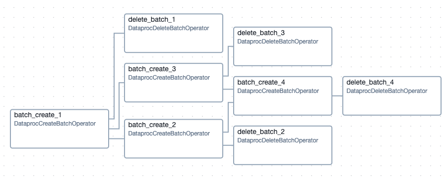

# gcp-airflow

## Overview
This project runs a DAG in Cloud Composer that orchestrates multiple Dataproc Serverless batches. Each batch processes data and writes an ID to BigQuery.

## Airflow DAG
  

## Installation

1. Replace and export with your correct value:

   ```bash
   export GOOGLE_APPLICATION_CREDENTIALS="?"
   export TF_VAR_project="?"
   ```

2. Create infrastructure:

   ```bash
   terraform -chdir="./infra" init -upgrade
   terraform -chdir="./infra" apply --auto-approve
   ```

3. Get the output variables:

   ```bash
   export BUCKET="$(terraform -chdir="./infra" output -raw bucket)"
   ```


4. Upload the python files:

   ```bash
   gsutil cp src/batch_dag.py gs://${BUCKET}/dags/
   gsutil cp src/batch.py gs://${BUCKET}
   ```

5. Run Query:

   ```bash
   bq query --project_id=${TF_VAR_project} --use_legacy_sql=False "SELECT BATCH_ID FROM test_airflow.batches ORDER BY BATCH_ID"
   ```

## Clean resources

1. Destroy resources:

   ```bash
   terraform -chdir="./infra" destroy --auto-approve
   ```